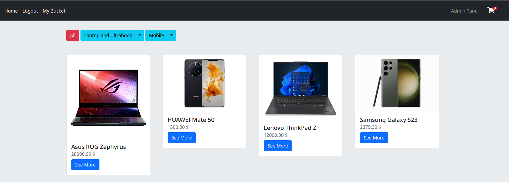
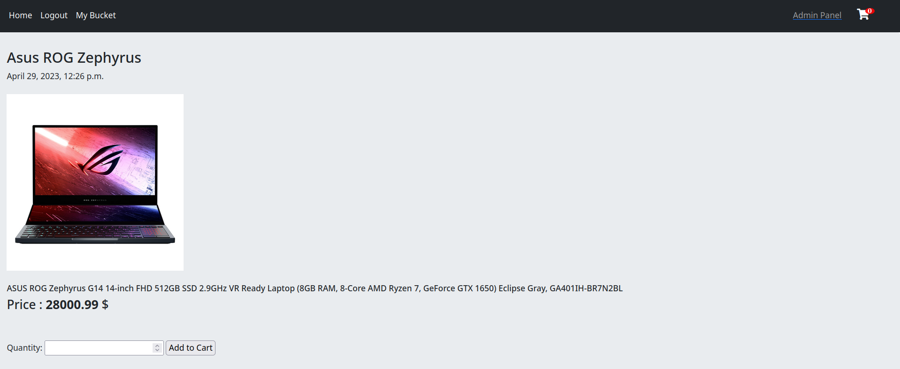
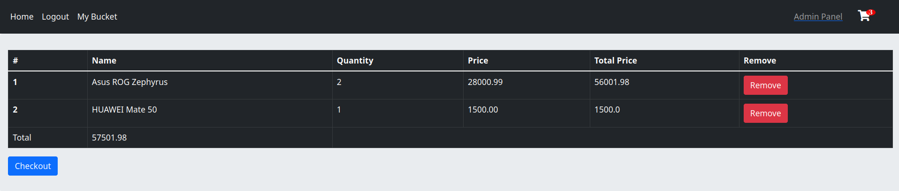
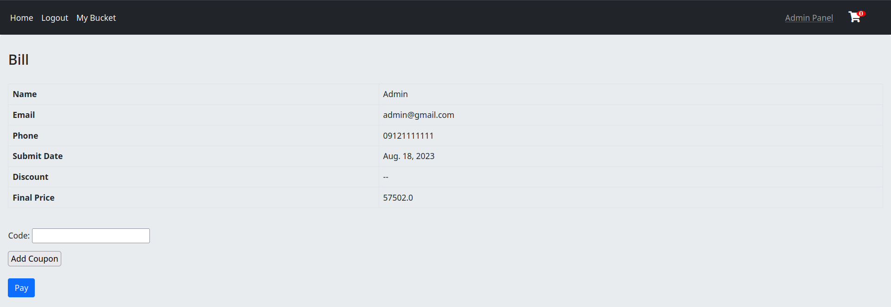
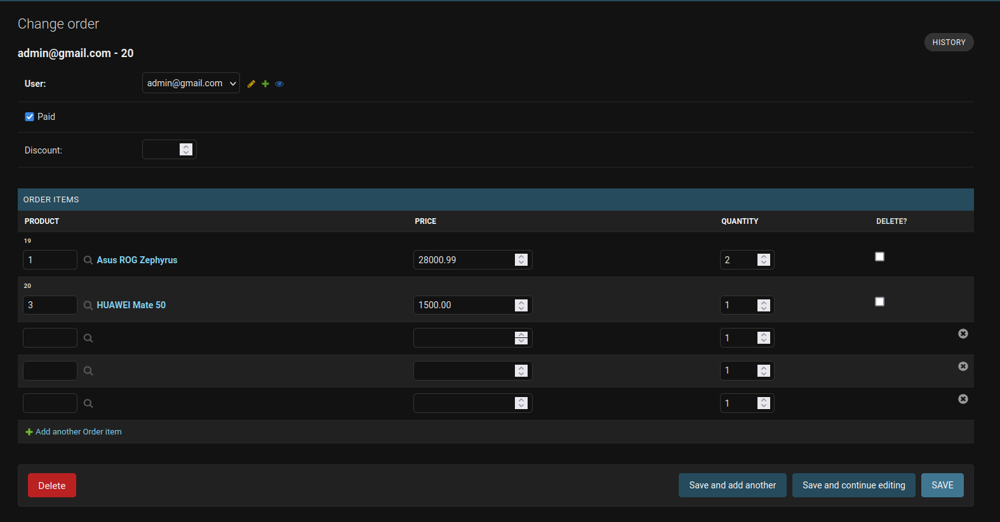
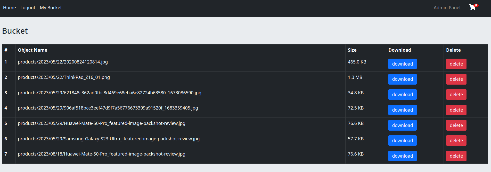

<p align="center">
  <br/>

  
  
  
  
  
  <br/>
  <br/>
</p>

# Welcome to pBay: Your Ultimate Online Marketplace

Hey there, curious minds and tech enthusiasts! Get ready to explore pBay, a passion project that's a blend of
innovation, self-challenge, and community spirit. 🚀

# A Personal Journey

At pBay, I've embarked on a thrilling journey of self-challenge and skill honing. This project isn't just an E-commerce
Web App – it's a testament to my determination to push boundaries and explore the fascinating world of full-stack
development.

# Features

- [x] Based on **Django 4**
- [x] **login** / **logout**, **register** 
- [x] Verify registration with **OTP code**
- [x] automatically remove expired OTP with **Celery Beat**
- [x] completely **custom** user model
- [x] **Groups** & **Permissions**
- [x] products show by **category**
- [x] media stored in **Object Storage**
- [x] Admin can **see** and **delete** or **download** items in object storage
- [x] actions on object storage items run **asynchronously** with **celery**
- [x] Cashing system with **Redis**
- [x] separate **product details** page
- [x] user can add product to **cart**
- [x] add/remove items from cart handled by **Session**
- [x] **Bill** and **Checkout** page
- [x] **Orders** model
- [x] **discount** feature based on **coupon**
- [x] **ckeditor** for product description
- [x] use **environment variable** to manage credentials
- [ ] **search** mechanism
- [ ] **Dockerized** whole project
- [ ] manage **celery** and **celery beat** with supervisord 
- [ ] order manager page
- [ ] add delivery methods
- [ ] add seller role to add/remove new product
- [ ] better bootstrap theme

# Requirements

```markdown
- python version > 3.8
- docker
```

# Run Locally

**Step 1 :** create a new virtualenv and install requirements.

```shell
$ pip install -r requirements.txt
```

**Step 2 :** rename `.env.example` to `.env`

```shell
$ mv .env.example .env
```

**Step 3 :** to use OTP code verification create an account in [kavenegar](https://kavenegar.com/) and 
put your API Key in `.env`.

> you need some KYC verification to use API completely

```dotenv
KAVENEGAR_OTP_SECRET="put your secret here"
```

**Step 4 :** if you want to store your media files in object storages (like aws, ...) set `USE_ARVAN_BUCKET` in 
environment file to `True` and set other secret keys.

> for this project i used [Arvan Cloud](https://www.arvancloud.ir/en/products/cloud-storage) object storage called bucket.
> since it uses `boto3` you can use any other object storage you want without any changes.

```dotenv
USE_ARVAN_BUCKET="True"
```

```dotenv
ARVAN_ACCESS_KEY_ID='put your keys here'
ARVAN_SECRET_ACCESS_KEY='put your keys here'
ARVAN_ENDPOINT_URL='put your keys here'
ARVAN_STORAGE_BUCKET_NAME='put your keys here'
```
**Step 5 :** go to `docker_compose_files` directory and run `Redis` and `RabbitMQ` containers.

```shell
$ docker compose up -d
```

**Step 6 :** run `celery` and `celery beat`.

```shell
$ celery -A config worker -l info
$ celery -A config beat -l INFO --scheduler django_celery_beat.schedulers:DatabaseScheduler
```

**Step 7 :** run django and reach whole project in [http://localhost:8000/](http://localhost:8000/).

```shell
$ python manage.py runserver
```

> you can use `db.sqlite3` DB that is in this project. if you use it, the user and pass for admin test user
> is `admin` and `12345`. some product are available within it.

**NOTE :** All credential in this project is for testing purpose DO NOT use it for production.

# Screenshots

### Home Page



### Product Details



### Cart



### Checkout & Bill



### Order



### Bucket Manager



# Contribution

Give a ⭐️ if you find pBay intriguing, share your insights, and let's keep the conversation alive. Contributions are
very welcome.

## You can help this project by Donating

[](https://buymeacoffee.com/promethe)

# License

Made by ❤️ under [MIT](https://choosealicense.com/licenses/mit/) license.

